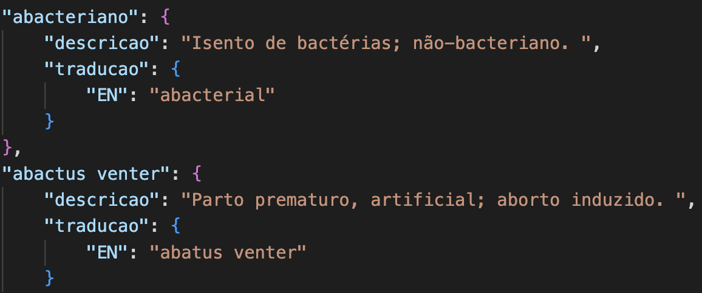
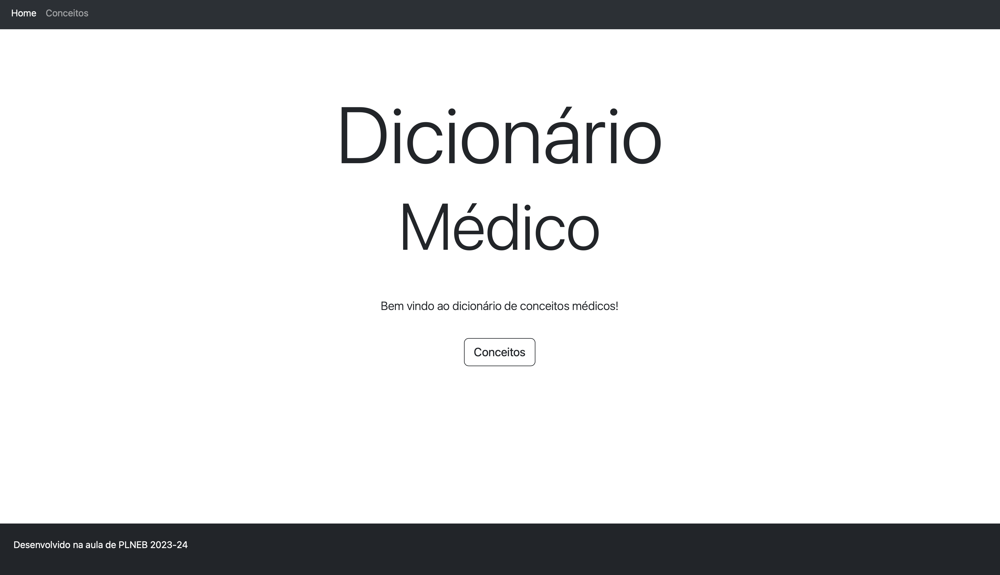
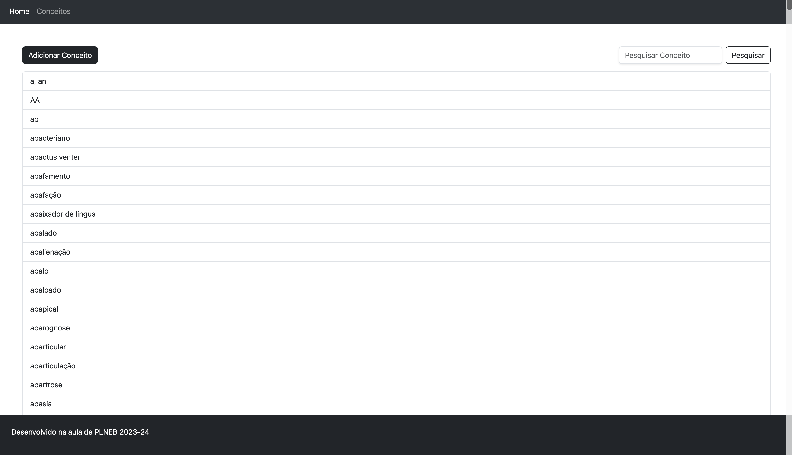
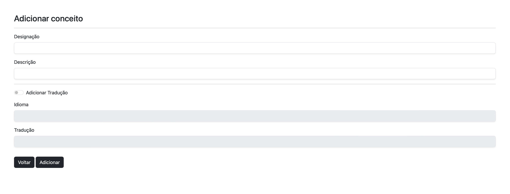
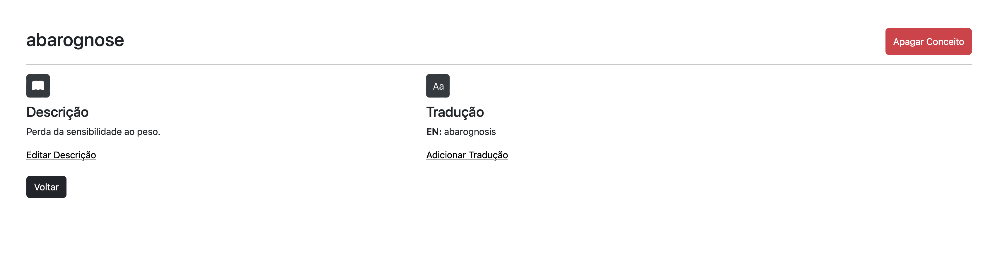
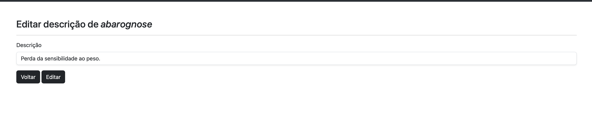
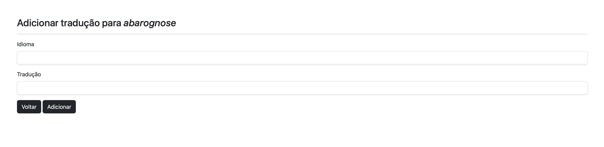
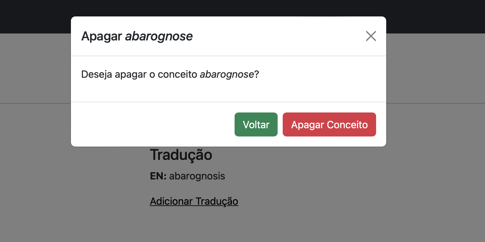

## Trabalho de Casa 6

Este trabalho consiste na criação de website que permite visualizar de forma intuitiva os conceitos médicos e suas respetivas traduções.

Para facilitar o desenvolvimento, o ficheiro *conceitos_trad.json* anteriormente criado no TPC5 foi modificado para que cada chave presente no dicionário o valor correspondente seja um dicionário com as chaves "descricao" e "traducao", conforme pode ser visualizado na imagem abaixo:

Foi utilizado o *framework* Flask para o desenvolvimento do website conforme pode ser visualizado no ficheiro *dicionarioMedico.py*. Foram criadas diferentes funções com suas respetivas *routes* permitindo que a interface criada seja dinâmica de forma com que o utilizador possa adicionar novo conceito com sua respetiva definição e tradução, editar uma descrição, adicionar uma nova tradução e pesquisar um determinado conceito.

Em relação à parte estética das páginas criadas foi utilizado o *framework* Bootstrap que utiliza as linguagens HTML, CSS e JavaScript. Os _templates_ criados estão presentes na diretoria "templates" e são chamados através das funções presentes no ficheiro *dicionarioMedico.py*. A fim de facilitar o desenvolvimento das páginas, foi criado um *template* base denominado "layout.html" que é retornado em todos os demais *templates* através de **.

Abaixo estão alguns *screenshots* de como o website foi desenvolvido:

